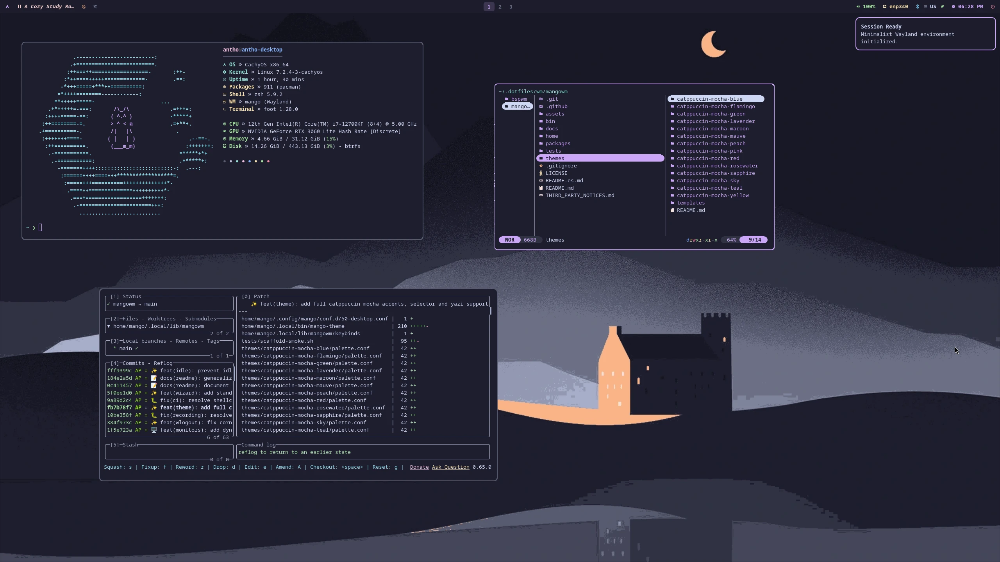

# MangoWM Dotfiles

*Read this in other languages:* [English](README.md)

Sesión Wayland autónoma, modular y minimalista configurada para **CachyOS** y **Arch Linux** utilizando [MangoWM](https://github.com/DreamMaoMao/mangowm) como compositor principal de ventanas en mosaico dinámico con el tema Catppuccin Mocha.

<p align="center">
  
</p>

> [!NOTE]
> **Trabajo en progreso:** Este repositorio se encuentra activamente mantenido y actualmente en etapa de finalización (P12). Ha sido exhaustivamente validado tanto en máquinas virtuales como en hardware físico real (Laptop HP ProBook 440 G10 en CachyOS con LUKS + Limine + Ly). Está diseñado para funcionar de manera 100% independiente o integrado con el ecosistema de dotfiles principal en [anthonyportugal/dotfiles](https://github.com/anthonyportugal/dotfiles) (rama `refactor/modular-dotfiles`).

---

## 🧱 Arquitectura Modular

Este repositorio utiliza una **arquitectura modular por capas** administrada mediante [GNU Stow](https://www.gnu.org/software/stow/). Cada componente está aislado en paquetes independientes, permitiendo instalaciones personalizadas para computadoras de escritorio, laptops o sistemas mínimos sin software innecesario (*zero bloat*).

```text
┌────────────────────────────────────────────────────────────────────────┐
│                      CAPA 3: FEATURES (A Demanda)                      │
│  ┌──────────────────────────────┐    ┌──────────────────────────────┐  │
│  │         mango-laptop         │    │       mango-recording        │  │
│  │  • Control de brillo monitor │    │  • Grabador de pantalla      │  │
│  │    (brightnessctl)           │    │    ligero (wf-recorder)      │  │
│  │  • Atajos teclas Fn brillo   │    │  • Atajo Super+Ctrl+R        │  │
│  │  • Monitor de batería        │    │  • Indicador de estado       │  │
│  └──────────────────────────────┘    └──────────────────────────────┘  │
├────────────────────────────────────────────────────────────────────────┤
│                  CAPA 2: PERFIL DESKTOP (Visual & UX)                  │
│  ┌──────────────────────────────────────────────────────────────────┐  │
│  │                          mango-desktop                           │  │
│  │  • Barra superior (Waybar)         • Menú de apagado (wlogout)   │  │
│  │  • Selector de fondos (Swaybg)     • Luz nocturna (Gammastep)    │  │
│  │  • Capturas con editor (Satty)     • Control multimedia          │  │
│  └──────────────────────────────────────────────────────────────────┘  │
├────────────────────────────────────────────────────────────────────────┤
│                    CAPA 1: CORE (Base Indispensable)                   │
│  ┌──────────────────────────────────────────────────────────────────┐  │
│  │                              mango                               │  │
│  │  • Compositor MangoWM              • Terminal (Foot)             │  │
│  │  • Lanzador de apps (Fuzzel)       • Bloqueo (Swaylock)          │  │
│  │  • Notificaciones (Mako)           • Motor de temas Catppuccin   │  │
│  │  • Portales Wayland XDG            • Atajos de teclado base      │  │
│  └──────────────────────────────────────────────────────────────────┘  │
└────────────────────────────────────────────────────────────────────────┘
```

### Desglose de Paquetes

| Paquete | Propósito | ¿Cuándo instalarlo? |
| :--- | :--- | :--- |
| **`mango`** *(Core)* | Base indispensable: configuración del compositor, terminal, lanzador, pantalla de bloqueo, notificaciones y generador de temas. | **Siempre obligatorio.** |
| **`mango-desktop`** | Experiencia completa de escritorio: barra superior (`Waybar`), menú de energía (`wlogout`), fondos de pantalla (`Swaybg`), luz nocturna y editor de capturas (`Satty`). | **Escritorios estándar y VMs.** |
| **`mango-laptop`** | Control de brillo por hardware (`brightnessctl`), atajos de teclas `Fn` de brillo y hooks de batería. | **Solo en Laptops.** |
| **`mango-recording`** | Script y atajo dedicado para grabación de pantalla con `wf-recorder`. | **Bajo demanda / Creadores.** |

---

## 🚀 Instalación y Perfiles

La herramienta incluida `./bin/mango` gestiona la instalación de paquetes y los enlaces simbólicos de GNU Stow con simulación segura por defecto.

### 1. Computadora de Escritorio / Máquina Virtual (Recomendado)
Instala la base `mango` y el escritorio `mango-desktop`:
```bash
./bin/mango bootstrap --profile desktop --apply
```

### 2. Configuración para Laptop
Instala `mango` + `mango-desktop` + `mango-laptop` (añade teclas de brillo e integración de batería):
```bash
./bin/mango bootstrap --profile desktop --feature laptop --apply
```

### 3. Estación de Trabajo Completa (con Grabación de Pantalla)
```bash
./bin/mango bootstrap --profile desktop --feature laptop --feature recording --apply
```

### 4. Núcleo Mínimo (Solo Administrador de Ventanas)
Instala únicamente el compositor, terminal y lanzador sin barra de estado ni demonios de escritorio:
```bash
./bin/mango bootstrap --profile core --apply
```

### Opciones Útiles del Asistente
- **Simulación Dry-run (Comprobación segura):** Omite `--apply` para previsualizar acciones sin modificar el sistema de archivos:
  ```bash
  ./bin/mango bootstrap --profile desktop
  ```
- **Diagnóstico del sistema:** Verifica enlaces e integridad de configuración:
  ```bash
  ./bin/mango doctor --profile desktop
  ```
- **Desvincular / Limpiar:** Retira los enlaces simbólicos de forma limpia:
  ```bash
  ./bin/mango unlink --profile desktop --apply
  ```
- **Gestores de paquetes compatibles:** Detección automática de `shelly`, `paru`, `yay` o `pacman` (configurable con `--backend <nombre>`).

---

## 🔗 Integración con Dotfiles Base

Aunque este repositorio funciona de forma **100% independiente**, se integra limpiamente con el ecosistema principal de dotfiles modulares:
- 🌐 **Repositorio Principal:** [anthonyportugal/dotfiles](https://github.com/anthonyportugal/dotfiles) *(Rama activa: `refactor/modular-dotfiles`)*
- **Ecosistema Compartido:** Cuando se instala junto al repositorio base, MangoWM sincroniza automáticamente preferencias globales de modo oscuro, alias de shell compartidos, configuraciones de Neovim y tokens de tema GTK mediante `$HOME/.local/lib/dotfiles/session-preferences`.

---

## 🎨 Tema y Paleta de Colores

El entorno está diseñado con **Catppuccin Mocha** utilizando **Pink (`#f5c2e7`)** como acento semántico principal.

- Archivo de paleta: `themes/catppuccin-mocha-pink/palette.conf`
- **Renderizado Atómico Dinámico:** El script `mango-theme` lee los tokens de la paleta y genera archivos de configuración en tiempo de ejecución para MangoWM, Foot, Fuzzel, Waybar, Mako, Swaylock y Wlogout bajo `$XDG_STATE_HOME/mangowm/theme/current/`.

---

## ⌨️ Atajos de Teclado Principales

| Atajo | Acción |
| :--- | :--- |
| `Super + Return` | Abrir terminal Foot |
| `Super + Shift + Return` | Abrir terminal Foot flotante |
| `Super + D` | Abrir lanzador de aplicaciones Fuzzel |
| `Super + B` | Abrir navegador web predeterminado (Brave) |
| `Super + Shift + E` | Abrir gestor de archivos gráfico (Thunar) |
| `Super + L` | Bloquear pantalla de inmediato (Swaylock) |
| `Super + X` | Abrir menú de apagado/sesión (Wlogout) |
| `Super + Shift + P` | Abrir selector interactivo de perfiles de energía (Fuzzel) |
| `Super + Shift + Q` | Cerrar sesión de MangoWM |
| `Super + Shift + R` | Recargar configuración de MangoWM |
| `Super + T` | Alternar modos de mosaico (*Dwindle, Tile, Grid, Monocle, Scroller*) |
| `Super + N` | Alternar luz nocturna cálida (Gammastep con indicador en Waybar) |
| `Super + W` / `Super + Ctrl + W` | Seleccionar fondo de pantalla interactivo con Fuzzel (Swaybg) |
| `Super + F1` / `Super + Shift + ?` | Abrir hoja de atajos interactiva |
| `Print` / `Super + Print` / `Super + Shift + S` | Captura de región con editor de anotaciones Satty |
| `Shift + Print` | Captura de pantalla completa con editor Satty |
| `Ctrl + Print` | Copiar captura de región directo al portapapeles |
| `Super + Ctrl + R` | Alternar grabación de pantalla *(requiere feature recording)* |

---

## 🧪 Pruebas Automatizadas

Ejecuta la suite de pruebas localmente para validar enlaces, manifests y la sesión:

```bash
./tests/scaffold-smoke.sh
./tests/bootstrap-smoke.sh
./tests/session-smoke.sh
```

---

## 📄 Licencia

El código y las configuraciones originales se distribuyen bajo la [Licencia MIT](LICENSE).
Las paletas de Catppuccin y avisos de terceros se detallan en `THIRD_PARTY_NOTICES.md`.
